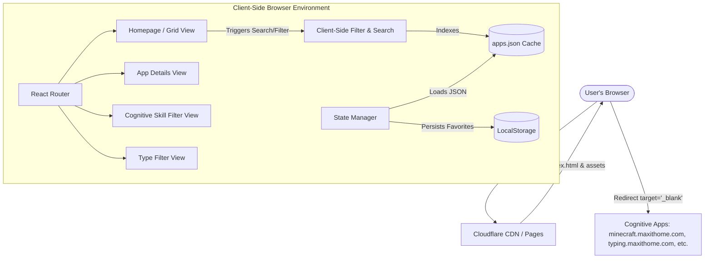
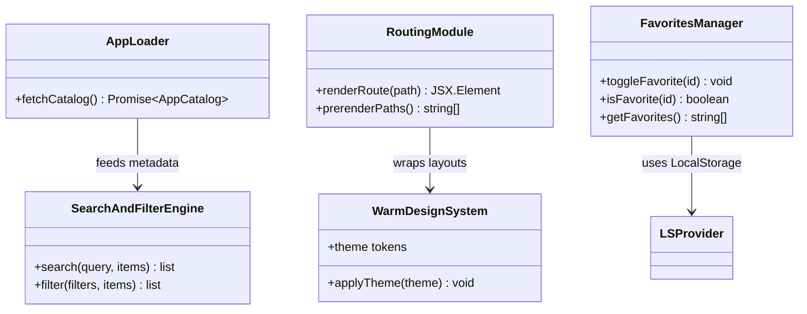

# MaxitHome System Architecture

This document defines the system architecture, module decomposition, build pipeline, and user accessibility design for MaxitHome v1.0, a frontend-only, metadata-driven cognitive application directory.

---

## 1. High-Level Architecture Overview

MaxitHome is hosted as a completely static web application on Cloudflare Pages. It relies entirely on client-side state, browser storage (`LocalStorage`), and static asset prerendering via Vite SSG. The platform acts as a gateway aggregator, guiding users to discover standalone cognitive apps hosted on distinct subdomains or external URLs.



---

## 2. Module Decomposition

The application is decomposed into five core modular blocks to ensure minimal coupling and maximum testability:



### 2.1 UI Layer (Components)
*   **Layout Wrapper:** Includes common Header (search bar, favorite/bookmarks filter toggle, theme switcher, title) and Footer (FTC disclaimer, Cloudflare Web Analytics tracker).
*   **App Card Grid:** Displays responsive grid layouts of individual app cards.
*   **App Details Component:** Displays comprehensive specifications, instructions, user screenshots, related apps, and redirects.
*   **Filter Panel:** Provides multi-dimensional checklist filters (Type, Cognitive Skill, Difficulty, Age Suitability).

### 2.2 Routing Module (`react-router-dom` & `vite-ssg`)
*   Manages user navigation between views: `/`, `/apps/:id`, `/skills/:skill`, `/type/:type`.
*   Updates document metadata (titles, tags, OpenGraph headers) via `react-helmet-async` for search engine crawler visibility.

### 2.3 Search & Filter Engine
*   Executes sub-second local search queries by tokenizing queries against app titles, short descriptions, long descriptions, and associated tags.
*   Resolves combinations of filter dimensions using AND logic across different dimensions, and OR logic within each dimension.

### 2.4 Favorites Manager (State & LocalStorage)
*   Toggles bookmarks and maintains the list of favorited app IDs.
*   Synchronizes values directly into the browser's `LocalStorage`.

---

## 3. Prerendering (SSG) & Build Pipeline

To ensure 100% SEO indexability on Cloudflare Pages without a backend runtime, MaxitHome utilizes **Vite SSG** (`vite-ssg`). 

During development, MaxitHome operates as a standard single-page app (SPA). At build time, Vite SSG compiles the app and runs a Node.js prerendering script that resolves all dynamic URLs by reading `public/apps.json`:

```
[Vite Build Engine]
       │
       ├─► Compile core assets (JS, CSS, HTML shell)
       │
       ├─► Read public/apps.json to extract all IDs, Skills, and Types
       │
       ├─► Generate static path list:
       │    ├─ "/"
       │    ├─ "/apps/sudoku", "/apps/minecraft", ...
       │    ├─ "/skills/memory", "/skills/logic", ...
       │    └─ "/type/game", "/type/tool", ...
       │
       └─► Render each route into a pre-compiled, search-engine-ready HTML file
```

---

## 4. Design System Tokens (Warm Mode Theme)

To ensure high readability and friendly visuals for seniors and children, the UI implements a curated, low-contrast, warm design palette.

| Token | Light Mode (Warm Cream/Sand) | Dark Mode (Cozy Slate/Amber) | Purpose |
| :--- | :--- | :--- | :--- |
| **Background** | `hsl(36, 33%, 97%)` (Warm cream) | `hsl(215, 25%, 12%)` (Slate grey) | Main canvas background |
| **Surface** | `hsl(36, 25%, 92%)` (Soft sand) | `hsl(215, 20%, 18%)` (Soft dark slate) | Card and filter containers |
| **Border** | `hsl(36, 12%, 80%)` (Warm grey border) | `hsl(215, 12%, 28%)` (Slate grey border) | Separation lines and borders |
| **Primary Text** | `hsl(24, 15%, 15%)` (Warm charcoal) | `hsl(36, 30%, 94%)` (Soft ivory) | Standard reading text |
| **Secondary Text**| `hsl(24, 10%, 40%)` (Muted brown-grey)| `hsl(36, 10%, 70%)` (Muted cream-grey)| Subtitles and descriptions |
| **Accent Primary**| `hsl(28, 80%, 48%)` (Warm orange/amber)| `hsl(38, 90%, 55%)` (Vibrant amber) | Highlighting active elements |
| **Accent Light** | `hsl(28, 80%, 94%)` (Pale orange tint) | `hsl(38, 90%, 20%)` (Deep amber tint) | Hover highlights / active states |
| **Focus Ring** | `hsl(28, 80%, 48%)` (Warm orange/amber)| `hsl(38, 90%, 55%)` (Vibrant amber) | Keyboard navigation outlines |

---

## 5. Accessibility (a11y) & Usability Strategy

MaxitHome targets WCAG 2.1 AA level compliance using these design parameters:

*   **Keyboard Navigation:** All interactive elements (filters, cards, detail tabs, search box) must receive a visible `:focus-visible` ring using the design system's Accent Focus token. Natural tab orders must be maintained across standard HTML elements.
*   **Touch Targets:** Buttons and interactive elements are built with a minimum touch surface area of `48px x 48px` (exceeding standard `44px x 44px` limits) with responsive margins to prevent accidental taps.
*   **Screen Readers:** Use semantic HTML tags (`<header>`, `<main>`, `<nav>`, `<article>`, `<section>`, `<footer>`). ARIA roles (e.g. `role="search"`, `aria-expanded`, `aria-checked`) must dynamic match client interactions. All images and screenshots require descriptive `alt` tags populated via `apps.json`.
*   **Zoom Support:** Layout containers must utilize flexible grids (`grid`, `flex`, `rem` or `%` spacing, instead of absolute `px` values) to ensure browser zoom up to 200% renders cleanly without content collisions.

---

## 6. System Considerations

### 6.1 Authentication & Security
*   **Zero-Auth:** There is no authentication backend or user session state.
*   **LocalStorage Security:** Saved favorites only store application ID arrays (e.g., `["minecraft", "sudoku"]`). No PII or credentials are stored.
*   **Subdomain Isolation:** Subdomain links are forced to open in a new tab (`target="_blank"` with `rel="noopener noreferrer"`) to prevent CORS sharing vulnerabilities and keep users engaged on the aggregator.

### 6.2 Observability & Analytics
*   **Privacy-First:** Integration of Cloudflare Web Analytics. Since it is cookie-free and hosted directly at the CDN layer or via a lightweight static JS tag, it respects client privacy while generating exit-click counts for each app detail link.
