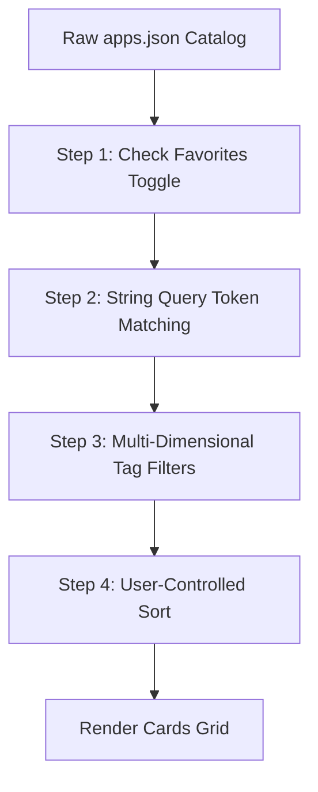

# MaxitHome Database & Storage Specification

This document outlines the client-side persistence, memory structures, and search-indexing algorithms for MaxitHome v1.0. As a frontend-only platform, it uses browser storage and client memory instead of a traditional server-side database.

---

## 1. Client-Side Persistence (`LocalStorage`)

All user personalization states (bookmarks and configuration options) are stored locally in the browser's `LocalStorage`.

### 1.1 Storage Keys & Schemas

The following distinct keys are reserved in the local storage namespace:

#### 1.1.1 Favorites List (`maxithome_favorites`)
Stores an array of unique app IDs representing the user's bookmarked applications.
*   **Data Type:** `string[]` (JSON serialized array)
*   **Default Value:** `[]`
*   **JSON Schema:**
    ```json
    {
      "type": "array",
      "items": {
        "type": "string"
      }
    }
    ```

#### 1.1.2 UI Theme Settings (`maxithome_theme`)
Stores the user's active color mode selection.
*   **Data Type:** `string` (enum)
*   **Default Value:** Matches user system preferences (`prefers-color-scheme`).
*   **Supported Values:** `"light" | "dark" | "system"`

#### 1.1.3 Font Scaling Preference (`maxithome_font_scale`)
Stores the font multiplier to support senior visual accessibility features.
*   **Data Type:** `string` (enum)
*   **Default Value:** `"normal"`
*   **Supported Values:** `"normal" | "large" | "extra-large"`

### 1.2 LocalStorage Error Handling & Fallbacks

To ensure compliance with non-functional security/privacy requirements (e.g., incognito browsing or blocked third-party storage cookies), client interaction with LocalStorage is protected by safe accessor wrappers:

```typescript
export function getLocalStorageItem<T>(key: string, defaultValue: T): T {
  try {
    if (typeof window === 'undefined') return defaultValue;
    const item = window.localStorage.getItem(key);
    return item ? (JSON.parse(item) as T) : defaultValue;
  } catch (error) {
    console.warn(`[Storage Warning] LocalStorage read failed for key "${key}":`, error);
    return defaultValue;
  }
}

export function setLocalStorageItem<T>(key: string, value: T): void {
  try {
    if (typeof window !== 'undefined') {
      window.localStorage.setItem(key, JSON.stringify(value));
    }
  } catch (error) {
    console.warn(`[Storage Warning] LocalStorage write failed for key "${key}":`, error);
  }
}
```

---

## 2. In-Memory Data Management & Indices

When the application fetches `/apps.json` during execution, the raw array is transformed in memory to support instantaneous directory lookups and search filtering.

### 2.1 App Lookup Map (`Map<string, CognitiveApp>`)
*   **Data Structure:** `Map<string, CognitiveApp>`
*   **Purpose:** Allows immediate \(O(1)\) resolution of details pages when navigating to `/apps/:id` or rendering related list components.
*   **Instantiation:**
    ```typescript
    const appLookupMap = new Map<string, CognitiveApp>();
    catalog.forEach(app => appLookupMap.set(app.id, app));
    ```

### 2.2 Related Apps Index (`Map<string, string[]>`)
*   **Data Structure:** `Map<string, string[]>`
*   **Purpose:** Stores lists of recommended app IDs that share cognitive skill tags, allowing immediate recommendation retrieval in `/apps/:id`.
*   **Algorithm:**
    ```typescript
    const skillIndexMap = new Map<string, string[]>();
    catalog.forEach(app => {
      app.tags.skills.forEach(skill => {
        if (!skillIndexMap.has(skill)) {
          skillIndexMap.set(skill, []);
        }
        skillIndexMap.get(skill)!.push(app.id);
      });
    });
    ```

---

## 3. Client-Side Search & Multi-Select Filter Algorithm

To deliver a sub-second response time for user searches, directory lookups use a pipeline that merges multi-dimensional filter conditions.



### 3.1 Multi-Dimensional Filtering Logic

Filters represent combinations of different categories. In compliance with **FR-2.3**:
1.  **OR Logic** is applied *within* a single dimension (e.g. selecting `Memory` OR `Focus` will include apps that have either memory or focus tags).
2.  **AND Logic** is applied *across* different dimensions (e.g. filtering by `Game` type AND `Memory` cognitive skill).

```typescript
export interface FilterState {
  type: string[];       // e.g. ['Game', 'Tool']
  skills: string[];     // e.g. ['Memory', 'Logic']
  difficulty: string[]; // e.g. ['Beginner']
  age: string[];        // e.g. ['Senior Friendly']
  showFavoritesOnly: boolean;
}

export function filterCatalog(
  catalog: CognitiveApp[],
  filters: FilterState,
  searchQuery: string,
  favorites: string[]
): CognitiveApp[] {
  return catalog.filter(app => {
    // 1. LocalStorage Favorites Filter
    if (filters.showFavoritesOnly && !favorites.includes(app.id)) {
      return false;
    }
    
    // 2. Global Text Search Match (Name, description, tags)
    if (searchQuery) {
      const q = searchQuery.toLowerCase().trim();
      const textMatch = 
        app.name.toLowerCase().includes(q) ||
        app.shortDescription.toLowerCase().includes(q) ||
        app.longDescription.toLowerCase().includes(q) ||
        app.tags.skills.some(s => s.toLowerCase().includes(q)) ||
        app.tags.type.some(t => t.toLowerCase().includes(q));
      if (!textMatch) return false;
    }

    // 3. Multi-Dimensional Tag Matching (AND across dimensions, OR within dimensions)
    
    // Dimension A: Type
    if (filters.type.length > 0) {
      const hasMatchingType = app.tags.type.some(t => filters.type.includes(t));
      if (!hasMatchingType) return false;
    }
    
    // Dimension B: Cognitive Skills
    if (filters.skills.length > 0) {
      const hasMatchingSkill = app.tags.skills.some(s => filters.skills.includes(s));
      if (!hasMatchingSkill) return false;
    }
    
    // Dimension C: Difficulty
    if (filters.difficulty.length > 0) {
      const hasMatchingDifficulty = app.tags.difficulty.some(d => filters.difficulty.includes(d));
      if (!hasMatchingDifficulty) return false;
    }
    
    // Dimension D: Age Suitability
    if (filters.age.length > 0) {
      const hasMatchingAge = app.tags.age.some(a => filters.age.includes(a));
      if (!hasMatchingAge) return false;
    }

    return true;
  });
}
```

### 3.2 User-Controlled Sort Options

After filtering, results are sorted based on the user's selected sort option from the Sort Dropdown:

| Sort Option | Key | Logic |
|---|---|---|
| Name (A → Z) | `name-asc` | Alphabetical ascending by `name` field |
| Name (Z → A) | `name-desc` | Alphabetical descending by `name` field |
| Recently Updated | `date-newest` | Descending by `updatedAt` ISO date field |
| Oldest First | `date-oldest` | Ascending by `createdAt` ISO date field |

The sort function (`sortCatalog`) is a pure function that creates a new sorted array without mutating the input. It operates on the already-filtered subset of apps.
