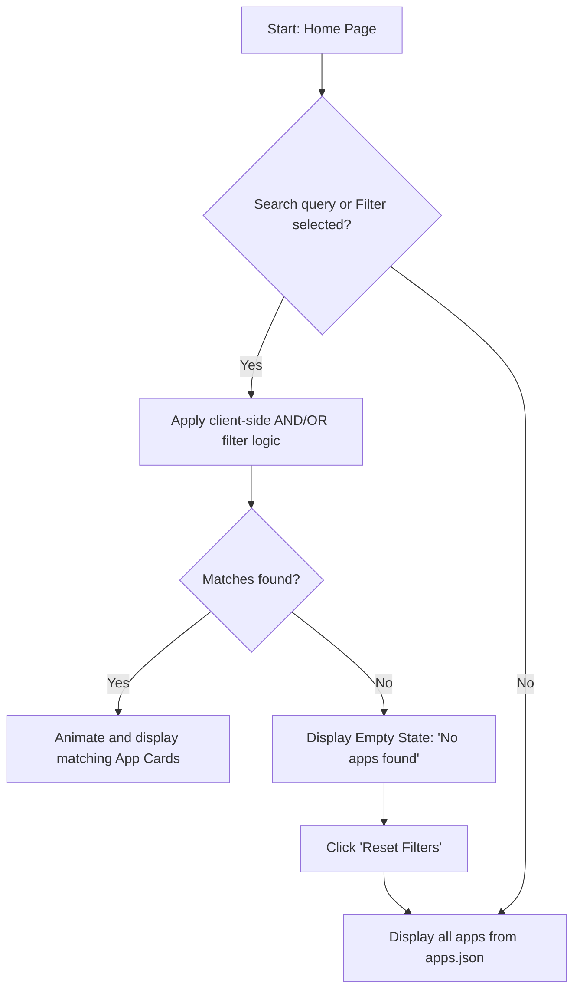
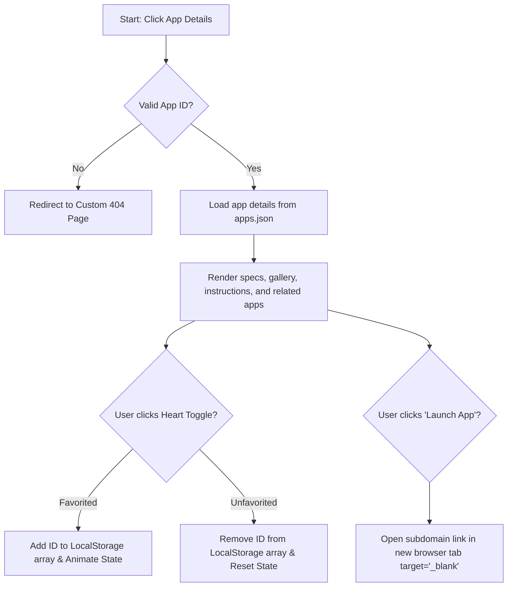
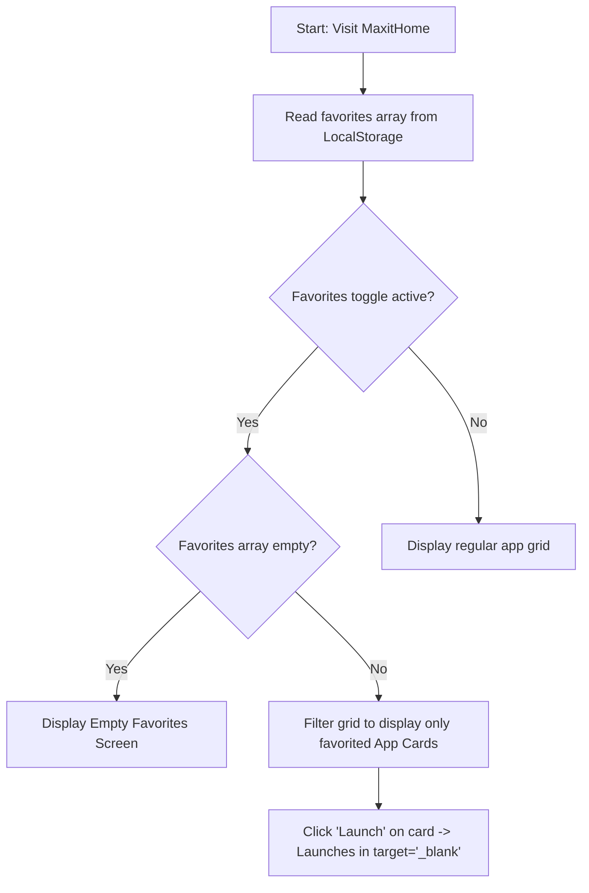

# User Flows

This document outlines the user flows, navigation paths, and key journeys for the MaxitHome platform.

---

## 1. Overview

### 1.1 Product Goals
*   **Centralized Discovery:** Help users find high-quality cognitive improvement apps and games.
*   **Zero Friction:** Provide instant access to app metadata, instructions, and bookmarks without registration.
*   **Inclusive Access:** Tailor the navigation, layout, and visual transitions for users ranging from age 8 to 80+.

### 1.2 Primary User Types
*   **Arthur (Senior, 72):** Navigates using large targets, relies on screen readers/high contrast, seeks memory retention tools, and wants password-less bookmarks.
*   **Leo (Child, 9):** Seeks colorful, game-oriented apps matching a low age barrier (8+), requiring visual, direct cues.
*   **Teens & Professionals (13-60):** Look for advanced reasoning, speed, and focus tools. They demand quick global searches and multi-select tags.

### 1.3 Entry Points
*   **Direct Access:** Landing directly on the Homepage (`/`).
*   **Deep Links (SEO):** 
    *   App details pages (`/apps/:id`) from search engines.
    *   Specific skill categories (`/skills/:skill`) or types (`/type/:type`).

---

## 2. User Journeys

### 2.1 Journey 1: App Discovery and Search/Filter

*   **User Objective:** Find a beginner-friendly cognitive game that trains logic for a 9-year-old child.
*   **Starting Point:** Homepage (`/`).
*   **Trigger:** The user wants to find suitable content for Leo.
*   **Navigation Sequence & Logic:**
    1.  User views the homepage with a full grid of cards loaded from `apps.json`.
    2.  User focuses on the search bar or the multi-select filter panel.
    3.  **Search Input (optional):** User types "logic" into the search bar. The search engine immediately filters matching apps.
    4.  **Multi-Select Filter Panel:**
        *   User clicks the `Game` tag under the **Type** category.
        *   User clicks the `Logic` tag under the **Cognitive Skill** category.
        *   User clicks the `Beginner` tag under the **Difficulty** category.
        *   User clicks the `8+` tag under the **Age Suitability** category.
    5.  **Branching Logic:**
        *   *If matching apps exist:* The grid dynamically updates using Framer Motion micro-animations, showing matching apps (e.g., "Herbert").
        *   *If no matching apps exist:* The grid transitions to an **Empty State** displaying a friendly message, "No apps match your criteria," along with a "Clear All Filters" button.
    6.  **Validation Steps:** The filter panel applies `AND` logic between different dimensions (Type AND Cognitive Skill AND Difficulty AND Age Suitability) and `OR` logic within the same dimension (e.g. Game OR Tool).
    7.  **Success Outcome:** User identifies "Herbert" as a matching card.
    8.  **Cancellation Path:** User can click "Reset Filters" to restore the complete grid.
    9.  **Error Handling / Recovery:** Input strings in search are sanitized to prevent injection. If search query consists of non-alphanumeric special characters, it degrades gracefully to showing an empty state rather than throwing an execution exception.

---

### 2.2 Journey 2: App Details View, Bookmarking, and External Launching

*   **User Objective:** View instructions for "FlashLearn", bookmark it to favorites, and play it.
*   **Starting Point:** App Card on Homepage or deep-linked path `/apps/flashlearn`.
*   **Trigger:** User clicks the "Details" button on the "FlashLearn" card.
*   **Navigation Sequence & Logic:**
    1.  User enters `/apps/flashlearn`. The page dynamically loads details matching the ID `flashlearn` from `apps.json`.
    2.  User reviews metadata: Name, Description, instructions ("How to Use"), screenshot gallery, tags, and difficulty.
    3.  User clicks the **Favorite Toggle** button (represented by a heart icon).
    4.  **Branching Logic (Bookmarking):**
        *   *If not favorited:* The app ID is appended to the `favorites` array in `LocalStorage`. The button state updates instantly to a solid colored heart (success animation).
        *   *If already favorited:* The app ID is removed from the `favorites` array. The button state returns to an outlined heart.
    5.  User clicks the **"Launch App"** button to launch the tool.
    6.  **Branching Logic (Launching):**
        *   The link opens in a new browser tab (`target="_blank"`) pointing to the app's subdomain/URL (e.g., `https://victorunique.github.io/flashlearn`), isolating the aggregator from the app's logic.
    7.  **Success Outcome:** The application is successfully bookmarked and launched in a new tab while the MaxitHome portal remains open in the original tab.
    8.  **Cancellation Paths:** User clicks the "Back to Directory" button or uses the browser back button, returning them to the previous filter state.
    9.  **Error Handling & Recovery:**
        *   *Invalid App ID:* If the URL has an ID not found in `apps.json` (e.g., `/apps/invalid-id`), the router directs the user to a custom 404 page with a "Back to Home" button.
        *   *Offline Storage Failure:* If browser `LocalStorage` is full or disabled, a non-intrusive warning badge indicates that "Favorites cannot be saved because cookies/storage are disabled."

---

### 2.3 Journey 3: Accessing Saved Favorites (Returning User)

*   **User Objective:** Quickly view and launch apps saved on previous visits.
*   **Starting Point:** Homepage (`/`).
*   **Trigger:** The user (e.g., Arthur) returns to MaxitHome to play his bookmarked Sudoku game.
*   **Navigation Sequence & Logic:**
    1.  User enters the site and notices the "Favorites Only" toggle in the header navigation.
    2.  User clicks the **"Favorites Only"** toggle (or navigates to the dedicated favorites route/section).
    3.  **Branching Logic:**
        *   *Favorites list not empty:* The grid filters down to only show the app cards whose IDs are present in the `LocalStorage` favorites array.
        *   *Favorites list empty:* The grid displays an empty state: "You haven't saved any apps yet! Browse the directory and click the heart icon to save."
    4.  **Success Outcome:** Arthur sees his Sudoku card immediately, clicks "Launch", and launches it in a new tab.
    5.  **Cancellation Path:** Turning off the "Favorites Only" toggle restores the full application grid.
    6.  **Offline Capability:** Since all data comes from a local `apps.json` cache and bookmarks come from `LocalStorage`, this entire favorites view is fully functional even if the user is offline.

---

## 3. Navigation Rules

### 3.1 Screen Transitions
*   All route changes (`/` ↔ `/apps/:id` ↔ `/skills/:skill` ↔ `/type/:type`) are animated using lightweight horizontal slides or cross-fades via **Framer Motion** to avoid jarring visual jumps.
*   Transitions must complete within 200–300ms to preserve responsiveness and prevent cognitive fatigue.

### 3.2 Back Navigation
*   A persistent, visible "Back to Directory" navigation link is placed at the top-left of every detail and filtered subpage.
*   The back action must preserve the user's previously applied filter settings and scroll position on the home directory grid using state history.

### 3.3 Deep Links & Route Mapping
*   Every route maps dynamically to document headers:
    *   `/` → `MindFlex | Cognitive Apps Aggregator`
    *   `/apps/:id` → `[App Name] | MindFlex Cognitive Apps`
    *   `/skills/:skill` → `[Skill Name] Apps | MindFlex`
    *   `/type/:type` → `[Type Name] Apps | MindFlex`
*   Dynamic titles and meta tags are loaded synchronously to ensure search crawlers index the correct metadata.

### 3.4 Modal Behaviour
*   For quick previews, detail views may optionally open as responsive overlays/dialogs on desktop viewports.
*   Modals must be dismissible by clicking the backdrop, pressing `Escape`, or clicking a close (`X`) button. Focus traps must be active inside the modal to maintain screen reader accessibility.
